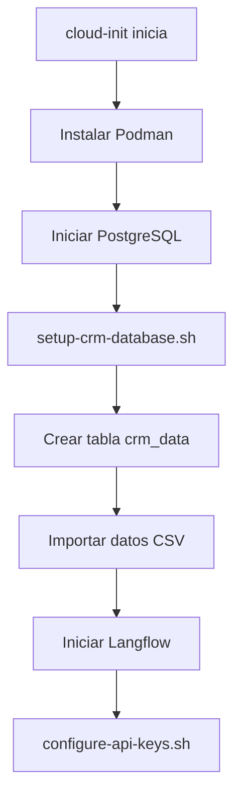

# 🗄️ Tabla CRM en PostgreSQL - Configuración Automática

## ✅ ¿Qué se Agregó?

Se configuró automáticamente una tabla `crm_data` en cada base de datos PostgreSQL con los datos de tus clientes.

---

## 📊 Estructura de la Tabla

### Tabla: `crm_data`

| Columna | Tipo | Descripción |
|---------|------|-------------|
| `id` | SERIAL (PRIMARY KEY) | ID único autoincremental |
| `nombre_completo` | TEXT | Nombre del cliente |
| `numero_documento` | BIGINT | Número de documento |
| `edad` | INTEGER | Edad del cliente |
| `estado_laboral` | TEXT | Estado laboral (Empleado, Independiente, etc.) |
| `ingreso_mensual` | INTEGER | Ingreso mensual en pesos |
| `egresos_mensuales` | INTEGER | Egresos mensuales en pesos |
| `tarjeta_de_credito_bronce` | BOOLEAN | Tiene tarjeta bronce |
| `tarjeta_de_credito_plata` | BOOLEAN | Tiene tarjeta plata |
| `tarjeta_de_credito_oro` | BOOLEAN | Tiene tarjeta oro |
| `cuenta_ahorros` | BOOLEAN | Tiene cuenta de ahorros |
| `seguro_mascotas` | BOOLEAN | Tiene seguro de mascotas |
| `seguro_desempleo` | BOOLEAN | Tiene seguro de desempleo |
| `complemento_medico` | BOOLEAN | Tiene complemento médico |
| `created_at` | TIMESTAMP | Fecha de creación del registro |

### Índices Creados:
- ✅ `idx_crm_numero_documento` - Búsqueda por documento
- ✅ `idx_crm_estado_laboral` - Filtrar por estado laboral
- ✅ `idx_crm_ingreso` - Filtrar por ingreso mensual

---

## 📝 Datos Incluidos

**30 registros de clientes** con información completa:
- Datos demográficos (nombre, edad, documento)
- Información financiera (ingresos, egresos)
- Productos contratados (tarjetas, seguros, cuenta ahorros)

---

## 🔧 Configuración Automática

### Archivos Agregados en cloud-init.yaml.tpl:

#### 1. `/root/crm_data.csv`
- Archivo CSV con los 30 registros
- Se copia automáticamente a cada VSI

#### 2. `/root/setup-crm-database.sh`
- Script que crea la tabla `crm_data`
- Importa datos desde el CSV
- Se ejecuta automáticamente después de iniciar PostgreSQL
- Logs: `/var/log/crm-setup.log`

### Proceso de Deployment:



---

## 🚀 Cómo Usar en Langflow

### Opción 1: Componente SQL Database

1. **En tu flow de Langflow**, arrastra el componente **"SQL Database"**

2. **Configurar conexión:**
   ```
   Database Type: PostgreSQL
   Host: 127.0.0.1
   Port: 5432
   Database: langflow_db
   User: langflow
   Password: passw0rd
   ```

3. **Ejecutar queries:**
   ```sql
   -- Ver todos los clientes
   SELECT * FROM crm_data;

   -- Clientes con ingresos > 5000
   SELECT * FROM crm_data WHERE ingreso_mensual > 5000;

   -- Clientes empleados con tarjeta oro
   SELECT nombre_completo, ingreso_mensual
   FROM crm_data
   WHERE estado_laboral = 'Empleado'
     AND tarjeta_de_credito_oro = true;

   -- Estadísticas por estado laboral
   SELECT estado_laboral,
          COUNT(*) as total_clientes,
          AVG(ingreso_mensual) as ingreso_promedio
   FROM crm_data
   GROUP BY estado_laboral;
   ```

### Opción 2: Componente Python con psycopg2

```python
import psycopg2

# Conectar a la base de datos
conn = psycopg2.connect(
    host="127.0.0.1",
    port=5432,
    database="langflow_db",
    user="langflow",
    password="passw0rd"
)

cursor = conn.cursor()

# Consultar datos
cursor.execute("SELECT * FROM crm_data LIMIT 10")
clientes = cursor.fetchall()

# Procesar resultados
for cliente in clientes:
    print(f"Cliente: {cliente[1]}, Ingreso: {cliente[5]}")

cursor.close()
conn.close()
```

### Opción 3: Componente Custom Tool

Crea un tool personalizado para consultas específicas:

```python
from langflow import CustomComponent
import psycopg2

class CRMDataTool(CustomComponent):
    def build(self, numero_documento: int):
        conn = psycopg2.connect(
            host="127.0.0.1",
            port=5432,
            database="langflow_db",
            user="langflow",
            password="passw0rd"
        )

        cursor = conn.cursor()
        cursor.execute(
            "SELECT * FROM crm_data WHERE numero_documento = %s",
            (numero_documento,)
        )

        cliente = cursor.fetchone()
        cursor.close()
        conn.close()

        return cliente
```

---

## 📊 Ejemplos de Queries Útiles

### 1. Buscar Cliente por Documento
```sql
SELECT * FROM crm_data
WHERE numero_documento = 18531599;
```

### 2. Clientes Elegibles para Upgrade de Tarjeta
```sql
SELECT nombre_completo, ingreso_mensual, estado_laboral
FROM crm_data
WHERE ingreso_mensual > 5000
  AND tarjeta_de_credito_oro = false
  AND estado_laboral IN ('Empleado', 'Independiente')
ORDER BY ingreso_mensual DESC;
```

### 3. Segmentación por Productos
```sql
SELECT
    COUNT(CASE WHEN tarjeta_de_credito_bronce THEN 1 END) as con_bronce,
    COUNT(CASE WHEN tarjeta_de_credito_plata THEN 1 END) as con_plata,
    COUNT(CASE WHEN tarjeta_de_credito_oro THEN 1 END) as con_oro,
    COUNT(CASE WHEN cuenta_ahorros THEN 1 END) as con_ahorro,
    COUNT(CASE WHEN seguro_mascotas THEN 1 END) as con_seguro_mascotas
FROM crm_data;
```

### 4. Capacidad de Ahorro (Ingreso - Egreso)
```sql
SELECT
    nombre_completo,
    ingreso_mensual,
    egresos_mensuales,
    (ingreso_mensual - egresos_mensuales) as capacidad_ahorro,
    CASE
        WHEN (ingreso_mensual - egresos_mensuales) > 2000 THEN 'Alta'
        WHEN (ingreso_mensual - egresos_mensuales) > 500 THEN 'Media'
        ELSE 'Baja'
    END as clasificacion
FROM crm_data
ORDER BY capacidad_ahorro DESC;
```

### 5. Clientes sin Productos Clave
```sql
-- Clientes sin cuenta de ahorros
SELECT nombre_completo, ingreso_mensual
FROM crm_data
WHERE cuenta_ahorros = false
  AND ingreso_mensual > 3000;

-- Clientes sin seguros
SELECT nombre_completo, estado_laboral
FROM crm_data
WHERE seguro_desempleo = false
  AND estado_laboral IN ('Informal', 'Independiente');
```

---

## ✅ Verificar Instalación

### Desde SSH:

```bash
# Conectarse a la VSI
ssh -i ssh-key-langflow root@<IP>

# Ver log de configuración CRM
cat /var/log/crm-setup.log

# Debe mostrar:
# ✓ Tabla crm_data creada exitosamente
# ✓ Datos CRM importados exitosamente: 30 registros

# Verificar directamente en PostgreSQL
podman exec postgres-1 psql -U langflow -d langflow_db -c "SELECT COUNT(*) FROM crm_data;"

# Debe retornar: 30
```

### Desde Langflow:

1. Crea un nuevo flow
2. Agrega componente "SQL Database"
3. Configura conexión (host: 127.0.0.1, port: 5432, user: langflow, pass: passw0rd)
4. Ejecuta: `SELECT * FROM crm_data LIMIT 5;`
5. Deberías ver 5 registros

---

## 🔒 Seguridad

### Credenciales de Conexión:
```
Host: 127.0.0.1 (localhost dentro de la VSI)
Port: 5432
Database: langflow_db
User: langflow
Password: passw0rd
```

⚠️ **IMPORTANTE**: Estas credenciales son para desarrollo/pruebas. Para producción, cambia la contraseña en:
- `cloud-init.yaml.tpl` línea con `POSTGRES_PASSWORD`

---

## 📈 Escalamiento

**Cada VSI tiene su propia copia de los datos CRM:**

```
VSI-1: PostgreSQL con tabla crm_data (30 registros)
VSI-2: PostgreSQL con tabla crm_data (30 registros)
...
VSI-N: PostgreSQL con tabla crm_data (30 registros)
```

**Ventajas:**
- ✅ Cada Langflow tiene acceso local rápido a los datos
- ✅ Sin dependencias entre VSIs
- ✅ Tolerante a fallos (una VSI caída no afecta otras)

**Consideraciones:**
- ⚠️ Los datos NO se sincronizan entre VSIs
- ⚠️ Si actualizas datos en VSI-1, NO se reflejan en VSI-2

---

## 🔄 Actualizar Datos

### Agregar Nuevos Clientes:

```sql
INSERT INTO crm_data (
    nombre_completo, numero_documento, edad, estado_laboral,
    ingreso_mensual, egresos_mensuales,
    tarjeta_de_credito_bronce, tarjeta_de_credito_plata, tarjeta_de_credito_oro,
    cuenta_ahorros, seguro_mascotas, seguro_desempleo, complemento_medico
) VALUES (
    'Juan Pérez', 12345678, 35, 'Empleado',
    4500, 2000,
    true, true, false,
    true, false, true, true
);
```

### Modificar CSV y Redeployar:

1. Edita `crm_data.csv` con nuevos datos
2. Modifica `cloud-init.yaml.tpl` con el nuevo contenido
3. Haz commit y push
4. Destroy y redeploy en Schematics

---

## 🎯 Ejemplo de Flow Completo

### Flow: "Asesor Financiero con CRM"

```
1. Chat Input (usuario pregunta por documento)
   ↓
2. SQL Database (consultar cliente por documento)
   ↓
3. LLM (analizar perfil financiero del cliente)
   ↓
4. SQL Database (buscar productos recomendados)
   ↓
5. LLM (generar recomendación personalizada)
   ↓
6. Chat Output (respuesta al usuario)
```

---

## 📋 Resumen de Cambios en el Código

### Archivos Modificados:
- ✅ `cloud-init.yaml.tpl` - Agregado CSV, script setup y ejecución

### Nuevos Archivos en VSI:
- `/root/crm_data.csv` - Datos de clientes
- `/root/setup-crm-database.sh` - Script de configuración
- `/var/log/crm-setup.log` - Log de instalación

### Tabla Creada:
- `langflow_db.crm_data` (30 registros)

### Tiempo de Setup:
- ~30 segundos adicionales después de iniciar PostgreSQL

---

## ✅ Checklist Post-Deployment

- [ ] Verificar log: `cat /var/log/crm-setup.log`
- [ ] Confirmar 30 registros: `SELECT COUNT(*) FROM crm_data;`
- [ ] Probar consulta en Langflow
- [ ] Verificar índices: `\d crm_data` en psql

---

**¡Listo! Cada deployment nuevo tendrá la tabla CRM configurada automáticamente.** 🎉
